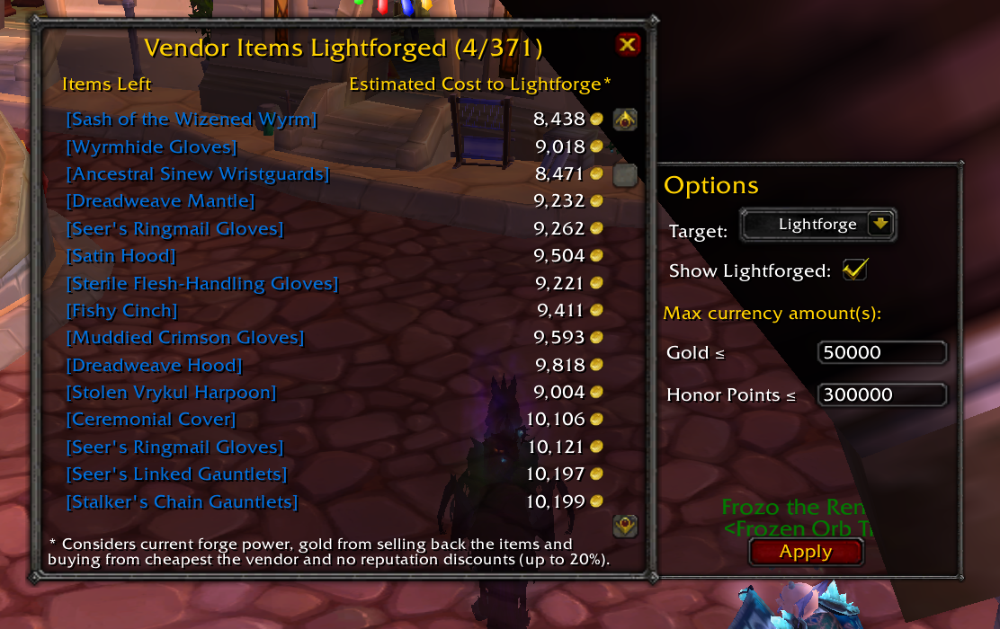
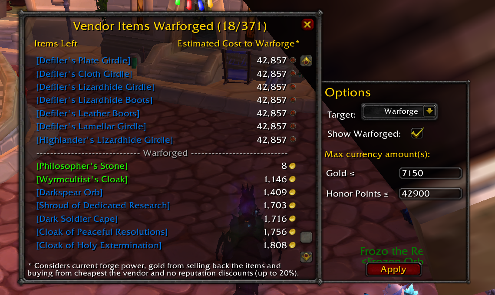
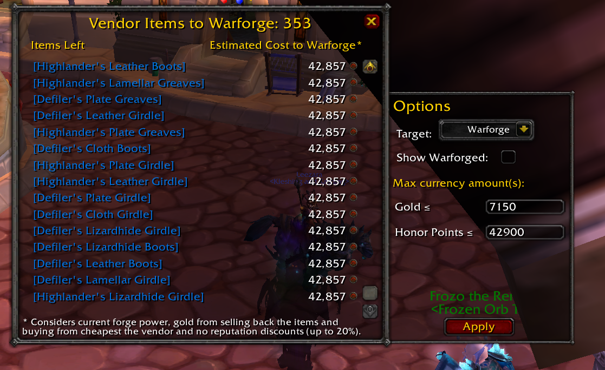

# VendorForgeList

**VendorForgeList** is a lightweight Synastria addon that allows you to **find and filter attunable vendor items**.

---

## 🔧 Features

- Precompiled database of affordable vendor items.
- Displays the vendor items below the set target forge level, and the estimated cost to forge them to that level.
- Settings panel to filter items by their expected cost to forge. Thresholds are specific to each forge level.
- Customizable forge level target.

---

## 📦 Installation

1. Download or clone this repository.
2. Move the `VendorForgeList` folder into your WoW AddOns directory:

   ```
   Synasatria/Interface/AddOns/
   ```

3. Restart the game or run `/reload`.

---

## 💬 Slash Commands

| Command | Description |
|---------|-------------|
| `/vfl` | Opens the UI. |

---

## 📸 Screenshots

|  In-game Examples |
|--------------------------------|
|      |

---


## 📜 License

GPL-3.0 license

---
